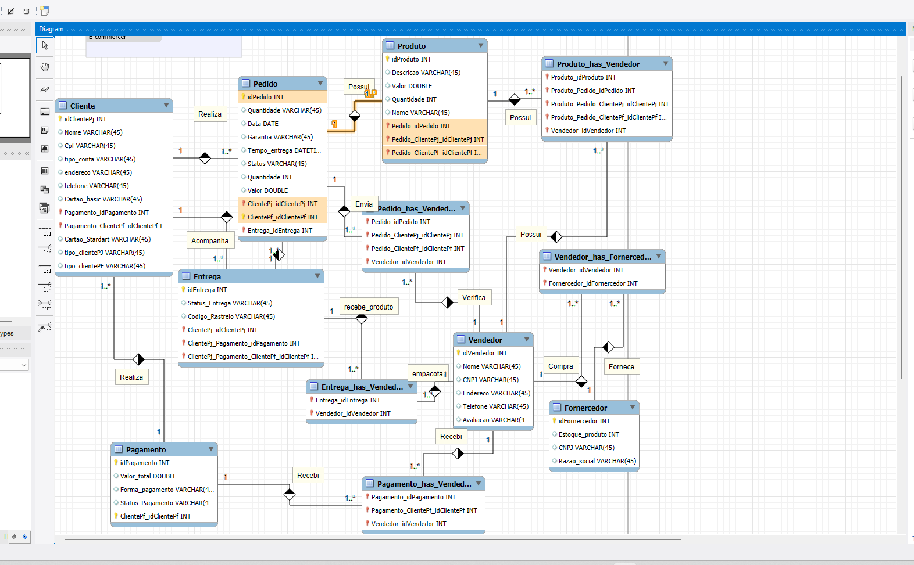
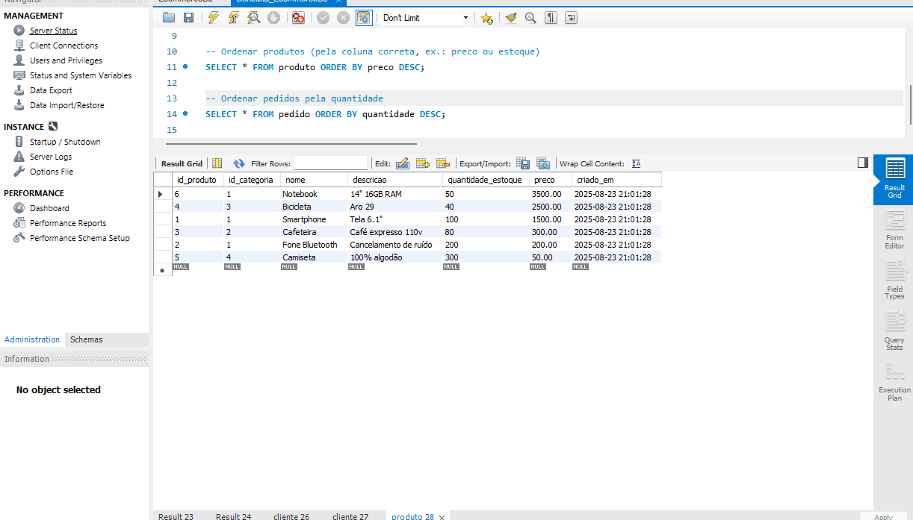

# 🛒 Projeto E-commerce - Banco de Dados MySQL

## 📌 Descrição
Este projeto implementa um **banco de dados relacional para um sistema de E-commerce**.  
O objetivo é armazenar informações de **clientes, produtos e pedidos**, permitindo realizar consultas de forma prática e eficiente para análises e relatórios.

O projeto foi desenvolvido em **MySQL** utilizando conceitos de:
- Criação de schemas e tabelas
- Chaves primárias e estrangeiras
- Consultas SQL (SELECT, JOIN, ORDER BY, GROUP BY, HAVING)
- Procedures, Views e Funções de Agregação

---

## 🖼 Demonstração

### Diagrama do Banco de Dados


### Consultas no Workbench


*(adicione suas imagens na pasta `imagens/` do repositório, com esses nomes ou altere os caminhos conforme desejar)*

---

## 🏗 Estrutura do Banco de Dados

- **cliente**
  - `id_cliente` (PK)
  - `nome`
  - `cpf`
  - `endereco`
  - `email`
  - `telefone`

- **produto**
  - `id_produto` (PK)
  - `nome`
  - `preco`
  - `estoque`
  - `categoria`

- **pedido**
  - `id_pedido` (PK)
  - `id_cliente` (FK → cliente)
  - `id_produto` (FK → produto)
  - `quantidade`
  - `data_pedido`
  - `valor_total`

---

## ⚙️ Scripts Principais

### Criar o banco e tabelas
```sql
-- Criar banco
CREATE DATABASE IF NOT EXISTS Ecommerce;
USE Ecommerce;

-- Tabela cliente
CREATE TABLE cliente (
  id_cliente INT AUTO_INCREMENT PRIMARY KEY,
  nome VARCHAR(100) NOT NULL,
  cpf VARCHAR(20) UNIQUE NOT NULL,
  endereco VARCHAR(150),
  email VARCHAR(100),
  telefone VARCHAR(20)
);

-- Tabela produto
CREATE TABLE produto (
  id_produto INT AUTO_INCREMENT PRIMARY KEY,
  nome VARCHAR(100) NOT NULL,
  preco DECIMAL(10,2) NOT NULL,
  estoque INT NOT NULL,
  categoria VARCHAR(50)
);

-- Tabela pedido
CREATE TABLE pedido (
  id_pedido INT AUTO_INCREMENT PRIMARY KEY,
  id_cliente INT NOT NULL,
  id_produto INT NOT NULL,
  quantidade INT NOT NULL,
  data_pedido DATE NOT NULL,
  valor_total DECIMAL(10,2),
  FOREIGN KEY (id_cliente) REFERENCES cliente(id_cliente),
  FOREIGN KEY (id_produto) REFERENCES produto(id_produto)
);
